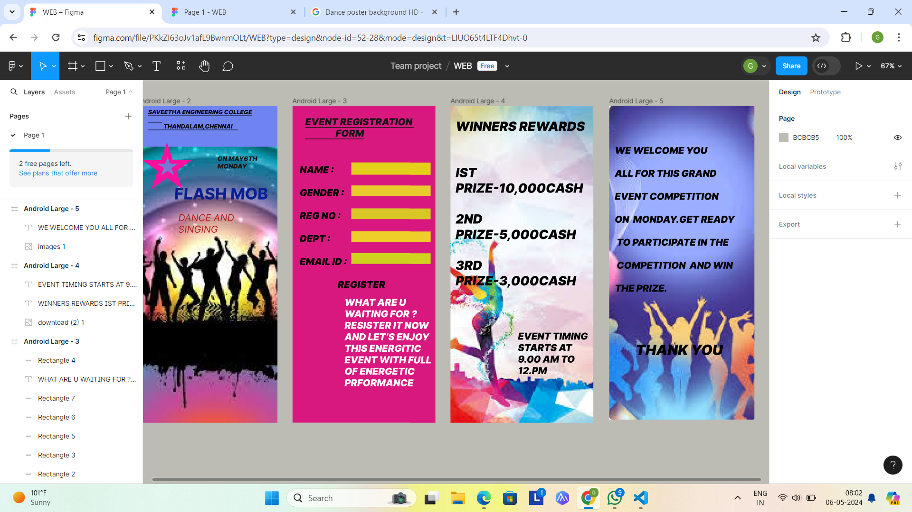

# Ex09 Event Registration Web Application
## Date:06.05.2024

## AIM:
To design, develop and deploy a web application for event registration.

## DESIGN STEPS:

### Step 1:
Create a new frame.

### Step 2:
Select any one preset size of your choice.

### Step 3:
Select the shapes you need.

### Step 4:
Import images as needed.

### Step 5:
Create pages based on your need and link them.

### Step 6:

Validate the HTML and CSS code.

### Step 6:

Publish the website in the given URL.

## DESIGN TOOL:
Figma

## CODE:
```
## PAGE 1:
<div style="width: 355px; height: 800px; position: relative; background: #6F84F1">
  
  <div style="width: 280px; left: 29px; top: 7px; position: absolute; color: black; font-size: 15px; font-family: Inter; font-style: italic; font-weight: 800; text-decoration: underline; word-wrap: break-word">SAVEETHA ENGINEERING COLLEGE<br/>           <br/>            THANDALAM,CHENNAI    <br/></div>
  <div style="width: 276px; height: 58px; left: 95px; top: 197px; position: absolute"><span style="color: #0A1F8C; font-size: 40px; font-family: Inter; font-style: italic; font-weight: 759; word-wrap: break-word">FLASH </span><span style="color: #092095; font-size: 40px; font-family: Inter; font-style: italic; font-weight: 759; word-wrap: break-word">MOB</span></div>
  <div style="width: 197px; height: 71px; left: 105px; top: 268px; position: absolute"><span style="color: #B01E1E; font-size: 24px; font-family: Inter; font-style: italic; font-weight: 400; word-wrap: break-word">DANCE AND <br/>SINGING<br/></span><span style="color: #B01E1E; font-size: 16px; font-family: Inter; font-style: italic; font-weight: 400; word-wrap: break-word">      <br/>       <br/></span><span style="color: #C21B1B; font-size: 16px; font-family: Inter; font-style: italic; font-weight: 400; word-wrap: break-word"><br/></span></div>
  <div style="width: 119px; height: 56px; left: 204px; top: 124px; position: absolute; color: #171718; font-size: 16px; font-family: Inter; font-style: italic; font-weight: 900; word-wrap: break-word">ON MAY6TH<br/>MONDAY</div>
</div>
```
## PAGE 2:
```
<div style="width: 360px; height: 800px; position: relative; background: #D8187F">
  <div style="width: 295px; height: 70px; left: 32px; top: 26px; position: absolute; color: #161515; font-size: 24px; font-family: Inter; font-style: italic; font-weight: 900; text-decoration: underline; word-wrap: break-word">EVENT REGISTRATION <br/>                FORM</div>
  <div style="width: 342px; height: 335px; left: 18px; top: 147px; position: absolute; color: black; font-size: 24px; font-family: Inter; font-style: italic; font-weight: 900; word-wrap: break-word">NAME :<br/><br/>GENDER :<br/><br/>REG NO :<br/><br/>DEPT :<br/> <br/>EMAIL ID :<br/>    <br/>                    REGISTER</div>
  <div style="width: 200px; height: 27px; left: 148px; top: 143px; position: absolute; background: #D9D9D9"></div>
  <div style="width: 200px; height: 27px; left: 148px; top: 143px; position: absolute; background: #D9D9D9"></div>
  <div style="width: 200px; height: 31px; left: 148px; top: 143px; position: absolute; background: #E4D01A"></div>
  <div style="width: 200px; height: 27px; left: 148px; top: 259px; position: absolute; background: #D9C728"></div>
  <div style="width: 200px; height: 27px; left: 148px; top: 317px; position: absolute; background: #EECE28"></div>
  <div style="width: 200px; height: 27px; left: 148px; top: 372px; position: absolute; background: #CFD31F"></div>
  <div style="width: 229px; height: 250px; left: 131px; top: 482px; position: absolute; color: white; font-size: 24px; font-family: Inter; font-style: italic; font-weight: 900; word-wrap: break-word">WHAT ARE U <br/>WAITING FOR ?<br/>RESISTER IT NOW <br/>AND LET’S ENJOY <br/>THIS ENERGITIC <br/>EVENT WITH FULL <br/>OF ENERGETIC <br/>PRFORMANCE<br/></div>
  <div style="width: 200px; height: 27px; left: 148px; top: 201px; position: absolute; background: #E9CB2D"></div>
</div>
```
## PAGE 3:
```
<div style="width: 360px; height: 800px; position: relative; background: #191414">
  
  <div style="width: 337px; height: 496px; left: 13px; top: 32px; position: absolute; color: black; font-size: 32px; font-family: Inter; font-style: italic; font-weight: 900; word-wrap: break-word">WINNERS REWARDS<br/><br/><br/>IST PRIZE-10,000CASH<br/><br/>2ND PRIZE-5,000CASH<br/><br/>3RD PRIZE-3,000CASH<br/></div>
  <div style="left: 170px; top: 567px; position: absolute; color: black; font-size: 24px; font-family: Inter; font-style: italic; font-weight: 900; word-wrap: break-word">EVENT TIMING<br/>STARTS AT<br/>9.00 AM TO<br/>12.PM</div>
</div>
```
## PAGE 4:
```
<div style="width: 366px; height: 792px; position: relative; background: #FDFAFA">
  
  <div style="width: 338px; height: 426px; left: 14px; top: 98px; position: absolute"><span style="color: black; font-size: 24px; font-family: Inter; font-style: italic; font-weight: 900; word-wrap: break-word">WE WELCOME YOU<br/> <br/>ALL FOR THIS GRAND <br/><br/>EVENT COMPETITION <br/><br/>ON  MONDAY.GET READY<br/><br/> TO PARTICIPATE IN THE <br/><br/> COMPETITION  AND WIN <br/><br/>THE PRIZE. <br/><br/><br/><br/><br/>           </span><span style="color: black; font-size: 36px; font-family: Inter; font-style: italic; font-weight: 900; word-wrap: break-word">THANK YOU</span></div>
</div>
```
## OUTPUT:



## RESULT:
The program to design, develop and deploy a web application for event registration is completed successfully.
